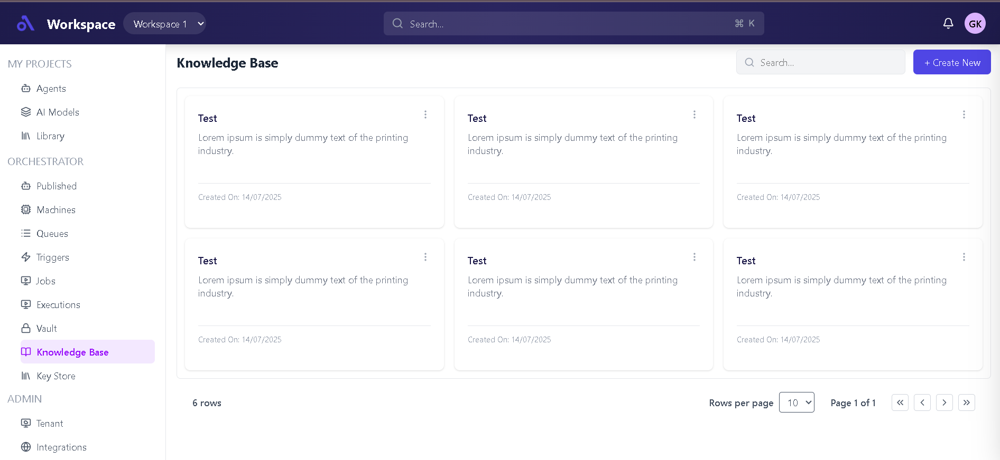
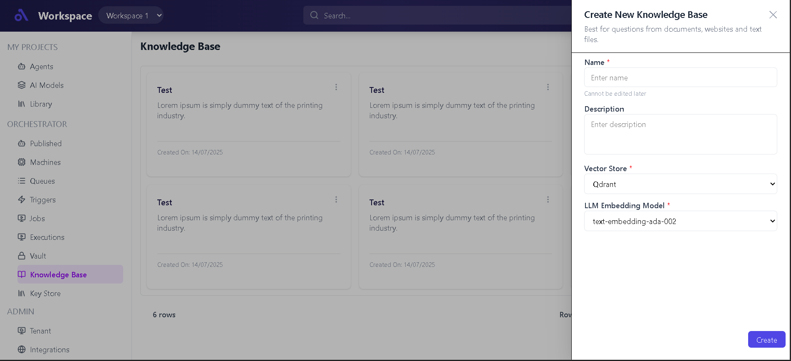

# 📘 Knowledge Base Dashboard (Frontend Assignment)

## 🚀 Overview

This project is a **Knowledge Base Dashboard UI** built using **React + Tailwind CSS**.  
It allows users to view, search, and create knowledge base entries through a clean and responsive interface.

---

## ✨ Features

- 📂 Sidebar Navigation (Projects, Orchestrator, Admin)
- 🔍 Global & Local Search
- 🧾 Knowledge Base Cards Grid
- ➕ Create Knowledge Base (Drawer Form)
- 📱 Fully Responsive Design
- 📄 Pagination Footer
- 🎯 Clean Dashboard Layout (Header + Sidebar + Content)

---

## 🛠️ Tech Stack

- **React.js**
- **Tailwind CSS**
- **Lucide Icons**
- **React Router DOM**

---
## 📁 Folder Structure

```
src
├── components
│   ├── Pages
│   │   └── CreateKnowledgeBaseForm.jsx
│   │
│   ├── Navbar.jsx
│   ├── Sidebar.jsx
│   ├── MainContent.jsx
│   ├── LeftContent.jsx
│   ├── RightContent.jsx
│   ├── Card.jsx
│   ├── Footer.jsx
│   ├── CreateButton.jsx
│   ├── MyProject.jsx
│   ├── Orchestrator.jsx
│   └── Admin.jsx
│
├── config
│   └── sidebarConfig.js
│
├── assets
│   └── (images, logos)
│
├── App.js
└── index.js
```
## 🧠 Application Flow

1. **Navbar**
   - Displays workspace info, search bar, notifications, and user profile.

2. **Sidebar**
   - Config-driven using `sidebarConfig`
   - Contains:
     - My Projects
     - Orchestrator
     - Admin

3. **Main Layout**
   - Split into:
     - Left → Sidebar
     - Right → Content Area

4. **Knowledge Base Section**
   - Displays cards in a responsive grid
   - Includes:
     - Search bar
     - Create button

5. **Create Functionality**
   - Clicking **Create** opens a **right-side drawer**
   - Drawer contains form:
     - Name
     - Description
     - Vector Store
     - Embedding Model

6. **Footer**
   - Displays:
     - Total rows
     - Pagination controls
     - Rows per page selector

---

## 🖼️ UI Screens

### 🔹 Knowledge Base Home Screen



---

### 🔹 Create Knowledge Base Drawer



---

## 📦 Installation & Setup

```bash
# Clone the repository
git clone https://github.com/Rani704/React_js_assignment

# Navigate into project
cd FrontEnd

# Install dependencies
npm install

# Start development server
npm run dev

⚙️ Key Implementation Details
- Sidebar is config-driven using sidebarConfig.js
- Used Flexbox + Tailwind CSS for layout
- Implemented responsive design with breakpoints
- Managed UI state using React Hooks (useState)
- Drawer implemented using CSS transform transitions
- Layout structured using:
- h-screen
- flex
- overflow handling

🚧 Improvements (Future Scope)
🔗 API Integration (CRUD operations)
🔐 Authentication & Authorization
📊 Dynamic Pagination
🧠 Search Optimization
🎨 UI Enhancements & Animations

🙌 Author
Rani

📌 Notes
This project focuses on frontend UI/UX implementation
Backend integration is not included

---


